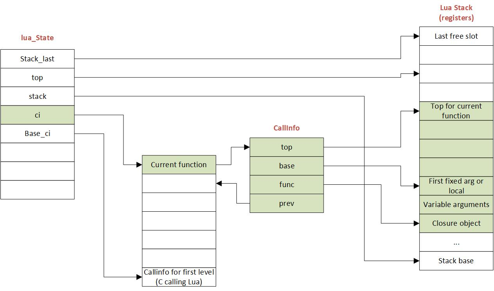

# 函数调用和返回

在整个虚拟机实现中，『函数的调用和返回』的实现，起到举足轻重的位置，所以需要详细研习。函数调用涉及到指令 `OP_CALL`，返回涉及到指令 `OP_RETURN`，传参涉及到 `OP_VARARG`，尾调用涉及到指令 `OP_TAILCALL`。注意，以下的讨论只基于 Lua 5.3。

## 函数调用

下图展示了 Lua 虚拟机在运行过程中的内部对象间的联系。



最左边的 lua_State 用于维护虚拟机运行的状态，这其中就包含了位于图中间的 Activation Records(或 Stack Frames) 和 栈(最右边)。活动记录(Activation Records) 也是一个栈结构，其中每一条记录使用 CallInfo 对象表示。活动记录用于记录和追踪函数的调用关系。栈 则是为了模拟寄存器，而寄存器的作用则是存放操作数和操作结果，需要注意的是，在虚拟机的实现中，栈的增长方向并没有模拟成其对应的物理实现，对应的物理实现的栈，其增长方向应该是由高到低的(downward)，见 [What Is a Stack?](https://github.com/hsiaosiyuan0/guide-to-assembly-language-programming-in-linux/blob/master/PART-V/writing-procedures.md#%E4%BB%80%E4%B9%88%E6%98%AF%E6%A0%88-what-is-a-stack)。

可以看到，虚拟机使用栈结构来模拟了寄存器，尽管它是基于寄存器的虚拟机，并没有直接操作物理 CPU 上的寄存器。另外，虚拟机并没有为每一次的函数调用开辟独立的栈空间，而是使用了一个大的栈，结合称为 滑动窗口(Sliding Window) 的技术，让每一次的函数调用都使用那一个大的栈。每次滑动窗口所需的信息，保存在活动记录栈顶的 CallInfo 对象中。

从硬件层面来看，函数调用的本质就是修改 IP 寄存器的内容，因为 CPU 只会机械的执行 IP 寄存器指向的指令。因为虚拟机是模拟的硬件实现，所以其内部肯定有相似的结构。所以『虚拟机中函数内部的指令如何被执行』的问题，就显得不那么重要，重要的是如何传入调用参数。

在了解参数如何传递之前，首先需要了解虚拟机中对函数调用栈的结构所做的规划。

```
                                     Two variable args and 1     Two variable args and no
Caller   One fixed arg               fixed arg                   fixed args
R(A)     CI->func  [ function    ]   CI->func  [ function    ]   CI->func [ function   ]
R(A+1)   CI->base  [ fixed arg 1 ]             [ var arg 1   ]            [ var arg 1  ]
R(A+2)             [ local 1     ]             [ var arg 2   ]            [ var arg 2  ]
R(A+3)                               CI->base  [ fixed arg 1 ]   CI->base [ local 1    ]
R(A+4)                                         [ local 1     ]
```

上图可以看成 4列。第 1列，从上往下看，表示栈索引，接着后面 3列 对应三个传参情况:

1. 固定参数 
2. 有变长参数和固定参数 
3. 只有变长参数

在讨论具体的传参之前，首先需要明白的是，在 Lua 5.3 中，函数的栈被划分为以下几部分，从低到高分别是:

1. 函数实例
2. 变长参数，如果有的话
3. 固定参数，如果有的话
4. 局部变量，如果有的话

当一个函数被调用时，栈将被设置成下面这样:

```
stack
|            function reference
|            var arg 1
|            ...
|            var arg n
| base->     fixed arg 1
|            ...
|            fixed arg n
|            local 1
|            ...
|            local n
|            temporaries
|            ...
|  top->
|
V
```

可以看到，`top` 的位置位于函数所需的寄存器数量 + 1 的位置。函数所需的寄存器数量由参数、局部变量和临时变量的数量共同决定。对于每一个 lua 函数，`base` 被设置为第一个固定参数或者局部变量的位置，随后在执行函数内部指令时，寄存器的寻址将基于 `base` 进行偏移，即 R(0) 表示栈上 `base+0` 的位置。

了解了这个划分结构之后，有助于理解传参时操作的意义。

## 固定参数

所谓固定参数，指的是在编译时即可获得参数的数量，比如下面的形式:

```lua
f(1, 2, 3)
```

上面的代码对应的字节码为:

```
main <stdin:0,0> (6 instructions at 0x7f9178403520)
0+ params, 4 slots, 1 upvalue, 0 locals, 4 constants, 0 functions
	1	[1]	GETTABUP 	0 0 -1	; _ENV "f"
	2	[1]	LOADK    	1 -2	; 1
	3	[1]	LOADK    	2 -3	; 2
	4	[1]	LOADK    	3 -4	; 3
	5	[1]	CALL     	0 4 1
	6	[1]	RETURN   	0 1
```

上面的指令由上到下，意义分别是:

1. 从全局变量中取得函数 `f`，放入栈中
2. 从常量表中载入常量 `1`，放入栈中
3. 从常量表中载入常量 `2`，放入栈中
4. 从常量表中载入常量 `3`，放入栈中
5. 执行函数调用指令 `CALL`
6. 返回指令暂时不考虑

下面来分析一下 `CALL` 指令。`CALL A B C`，A 表示需要调用的函数，B 表示参数数量，C 表示需要的返回值数量。

B 的值有如下几种情况:

1. 值为 1，表示没有参数
2. 值为 2及以上，参数数量为 B-1
3. 值为 0，表示采用变长参数

这里我们的 B 为 4，则参数数量为 3 即 B-1。

C 的值有如下几种情况:

1. 值为 1，表示不需要返回值
2. 值为 2及以上，表示需要的返回值数量为 C-1
3. 值为 0，表示被调函数的所有返回值都需要

这里我们的 C 为 1，表示函数的返回值将被丢弃。

## 变长参数

固定参数和变长参数混合、以及只有变长参数，这两个情况下，CI->base 的处理都很简单且类似，这是因为函数的固定参数数量以及局部变量和临时变量的数量，在编译期间都是可以很直接地得到的。我们知道之所以称之为变长参数，就是因为在编译期间无法得到具体的参数数量，那么如何做到将它们夹在被调函数和 CI->base 之间的呢。

看一个具体的例子:

```lua
function g() return 1,2 end
f(1, g())
```

上面的代码对应的字节码如下:

```
main <stdin:0,0> (8 instructions at 0x7fe93d402b70)
0+ params, 3 slots, 1 upvalue, 0 locals, 3 constants, 1 function
	1	[1]	CLOSURE  	0 0	; 0x7fe93d402d00
	2	[1]	SETTABUP 	0 -1 0	; _ENV "g"
	3	[2]	GETTABUP 	0 0 -2	; _ENV "f"
	4	[2]	LOADK    	1 -3	; 1
	5	[2]	GETTABUP 	2 0 -1	; _ENV "g"
	6	[2]	CALL     	2 1 0
	7	[2]	CALL     	0 0 1
	8	[2]	RETURN   	0 1

function <stdin:1,1> (4 instructions at 0x7fe93d402d00)
0 params, 2 slots, 0 upvalues, 0 locals, 2 constants, 0 functions
	1	[1]	LOADK    	0 -1	; 1
	2	[1]	LOADK    	1 -2	; 2
	3	[1]	RETURN   	0 3
	4	[1]	RETURN   	0 1
```

我们可以看到，主函数中第二个 CALL 的 B 为 0，通过上面的分析我们知道，B 为 0 表示需要传递给被调函数的参数为变长参数。我们来逐步分析栈上的内容。
上述字节码中，主函数的第三条指令，将 f 载入栈中，接着将常量 1 载入栈中，接着又将函数 g 载入栈中，到这里时，栈中的内容如下:

```
f
1
g
```

到这里栈上内容还是很好理解的，我们首先要执行的是对函数 f 的调用，而执行对函数调用则需要先将函数载入栈中，然后将参数载入栈中，之后执行 CALL 指令。
而我们在处理到第二个参数的时候，发现它的值来源于另外的函数调用 `g`，且为位于最后一个参数，则需要将该函数的返回值全部作为 `f` 的参数。

接着我们调用函数 g，指令为 `CALL 2 1 0`，注意到，C 为 0，表示所有的返回值都需要，接着我们来到函数 g 内部，在 RETURN 之前，栈中的内容如下:

```
f
1
g
1
2
```

现在可以了解一下 RETURN 指令的工作方式，`RETURN  A B`

对于 B 的值:

1. 如果是 1，则表示没有返回值
2. 如果是 2及以上，则表示有 B-1 个返回值
3. 如果是 0，则返回值为从 R(A) 到 栈顶 top 的内容

当 B 为 0 的时候，在执行 RETURN 之前的指令已经设置过栈顶 top 了，这些指令一定是 OP_CALL 或者 OP_VARARG。RETURN 会将返回结果拷贝给调用方，将返回结果覆盖到从当前函数的地址开始增加、直到方向所有返回值的位置，并将栈顶指针(L->top) 设置为最后一个参数位置 + 1 的位置。其实这里还需要注意的是，这个『覆盖从当前函数地址开始...』的操作，不光是起到了将返回值传递给调用方的作用，还兼顾了清理背调函数使用的栈空间的作用。

那么现在结合 RETURN 指令，我们可以知道在 RETURN 指令执行后，栈的内容变成:

```
f
1
1
2
  <- L->top
```

但是我们注意到，目前的栈中参数的顺序是不符合规则的，现在的顺序是 `被调函数 f -> 固定参数 1 -> 变长参数 1 -> 变长参数 2`。根据规则，变长参数应该在 CI->fn 和 CI->base 之间，不必担心，在执行 OP_CALL 指令时，有一个 `luaD_precall` 函数来调整参数的位置，以适应我们的规则。在该函数中，具体调整参数位置的是函数 [adjust_varargs](https://sourcegraph.com/github.com/lua/lua@v5.3/-/blob/ldo.c#L293)，我们可以简单了解一下它是如何调整参数位置的：

```c
static StkId adjust_varargs (lua_State *L, Proto *p, int actual) {
  int i;
  int nfixargs = p->numparams;
  StkId base, fixed;
  /* move fixed parameters to final position */
  // 找到第一个固定参数的位置
  fixed = L->top - actual;  /* first fixed argument */
  // 将 base 设置为 L->top
  base = L->top;  /* final position of first argument */
  // 将固定参数移动到 base 之后
  for (i = 0; i < nfixargs && i < actual; i++) {
    setobjs2s(L, L->top++, fixed + i);
    setnilvalue(fixed + i);  /* erase original copy (for GC) */
  }
  for (; i < nfixargs; i++)
    setnilvalue(L->top++);  /* complete missing arguments */
  return base;
}
```

经过这番调整之后，栈中的内容变为:

```
f
nil
1
2
1  <- CI->base
```
这就符合了我们提到的规范 - 变长参数位于被调函数和 CI->base 之间。