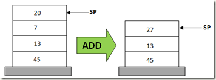
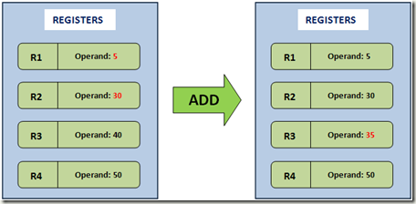

# 比较基于栈的、和基于寄存器的虚拟机

『Lua 虚拟机』从 5.0 开始采用『基于寄存器』的虚拟机实现，所以我们需要简单了解一下『基于寄存器的虚拟机』与『基于栈的虚拟机』之间有什么不同。

虚拟机(Virtual Machine - VM) 是对底层操作系统的高级抽象，它可以用来模拟物理机器的运行。一般而言，虚拟机需要实现一下几个功能：

* 将源码编译为适用于 VM 的字节码
* 用于涵盖指令以及操作数的数据结构
* 一个栈结构，用于函数的调用操作
* 一个指令指针(Instruction Pointer) 用于指向下一条需要执行的指令
* 一个虚拟的 CPU，用于执行指令:
    * 取得指令
    * 解码指令
    * 执行指令

目前有两种主流的方式来实现虚拟机：基于栈的，和基于寄存器的。基于栈的虚拟机实现有：JVM, .Net CLR, Python。基于寄存器的虚拟机实现有 Lua VM, 和 Dalvik VM 。两种实现的不同在于存储和取回操作数、以及操作结果的方式。

## 基于栈的虚拟机

基于栈的虚拟机实现了前文提到的那些虚拟机所需的一般功能，不过选择了栈结构来存放操作数。操作的实现通过将数据从栈上弹出、处理之后再压回栈中。在基于栈的虚拟机中，将两个数相加的操作一般以下面的方式实现：

1. POP 20
2. POP 7
3. ADD 20, 7, result
4. PUSH result

因为 PUSH 和 POP 操作，需要四行指令去完成加法操作。基于栈的模型的一个好处在于，操作数是通过 栈指针(Stack Point -SP) 隐式访问到的。也就是说，虚拟机不需要显式地对操作数进行寻址，只要通过 POP 操作 SP 即可得到下一个操作数。在基于栈的虚拟机中，所有的数学和逻辑操作都是通过将操作数和操作结果进行 POP 和 PUSH 来完成的。

## 基于寄存器的虚拟机

在基于寄存器的实现中，只需要一条指令实现加法操作：

1. ADD R1, R2, R3

因为不需要使用 PUSH 和 POP，所以需要对操作数进行显式地寻址。

基于寄存器的实现有几点好处：

1. 过度的 PUSH POP 操作不复存在，因此在指令派发循环中会表现得更快
2. 可以做一些基于栈的实现无法完成的指令优化(基于寄存器复用)

缺点:

1. 指令占字节大小相对基于栈的实现而言更大(因为指令需要包含操作数寻址)

## 一些误区

* 并不是使用了栈结构的就是基于栈的虚拟机，比如 Lua VM，就使用了栈结构来模拟寄存器，即使使用了栈结构，它也依然是基于寄存器的虚拟机
* 基于寄存器的虚拟机并不一定就会直接使用物理的 CPU 寄存器，只是说模拟『基于寄存器的 CPU』的工作方式，比如 Lua VM，它是基于寄存器的虚拟机，但是它使用一个栈结构来模拟寄存器
* 尽管基于寄存器的实现在指令执行阶段消耗更少的资源，但是目前并没有明确的研究结果表明哪一种实现更快

## 小结

简单地说，如果需要显式地进行操作数寻址的，那么它就是基于寄存器的虚拟机，同样的，如果使用 SP 进行隐式地操作数寻址的，那么它就是基于栈的虚拟机。

## 引用

* [Stack based vs Register based Virtual Machine Architecture, and the Dalvik VM](https://markfaction.wordpress.com/2012/07/15/stack-based-vs-register-based-virtual-machine-architecture-and-the-dalvik-vm/)